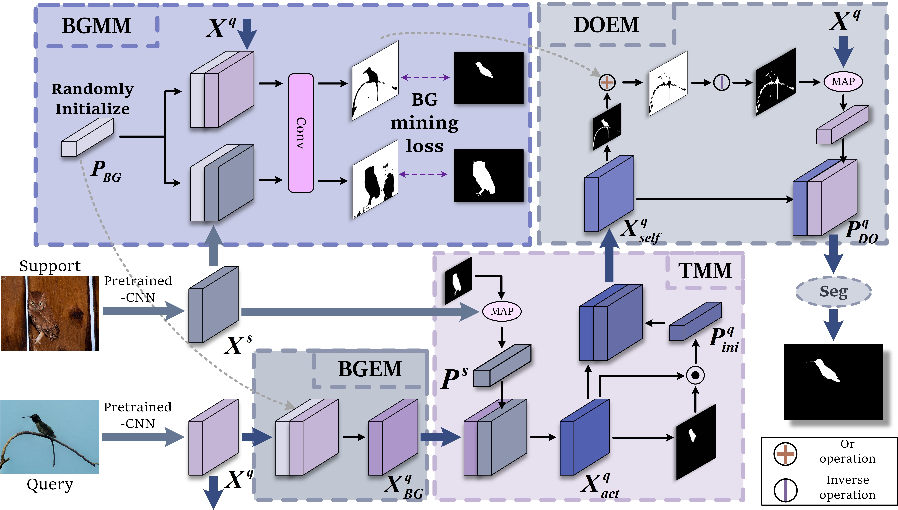
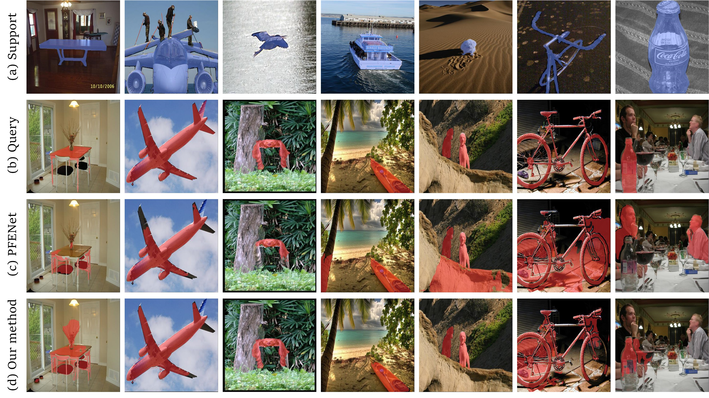

# NTRENet++: Unleashing the Power of Non-target Knowledge for Few-shot Semantic Segmentation

This repo contains the code for our paper "*NTRENet++: Unleashing the Power of Non-target Knowledge for Few-shot Semantic Segmentation*" by Nian Liu, Yuanwei Liu, Yi Wu, Hisham Cholakkal, Rao Muhammad Anwer, Xiwen Yao, and Junwei Han. 

> **Abstract:** *Few-shot semantic segmentation (FSS) aims to segment the target object under the condition of a few annotated samples. However, current studies on FSS primarily concentrate on extracting information related to the  object, resulting in inadequate identification of ambiguous regions, particularly in non-target areas, including the background (BG) and Distracting Objects (DOs). Intuitively, to alleviate this problem, we propose a novel framework, namely NTRENet++, to explicitly mine and eliminate BG and DO regions in the query. First, we introduce a BG Mining Module (BGMM) to extract BG information and generate a comprehensive BG prototype from all images. For this purpose, a BG mining loss is formulated to supervise the learning of BGMM, utilizing only the known target object segmentation ground truth. Subsequently, based on this BG prototype, we employ a BG Eliminating Module to filter out the BG information from the query and obtain a BG-free result. Following this, the target information is utilized in the target matching module to generate the initial segmentation result. Finally, a DO Eliminating Module is proposed to further mine and eliminate DO regions, based on which we can obtain a BG and DO-free target object segmentation result. Moreover, we present a prototypical-pixel contrastive learning algorithm to enhance the model's capability to differentiate the target object from DOs. Extensive experiments conducted on both PASCAL-5i and COCO-20i datasets demonstrate the effectiveness of our approach despite its simplicity. Additionally, we extend our approach to the few-shot video segmentation task and achieve state-of-the-art performance on the YouTube-VIS dataset, demonstrating its generalization ability.*

  

## &#x1F527; Usage
### Dependencies

- Python 3.8
- PyTorch 1.7.0
- cuda 11.0
- torchvision 0.8.1
- tensorboardX 2.14

### Datasets

- PASCAL-5i:  [VOC2012](http://host.robots.ox.ac.uk/pascal/VOC/voc2012/) + [SBD](http://home.bharathh.info/pubs/codes/SBD/download.html)

- COCO-20i:  [COCO2014](https://cocodataset.org/#download)

### Visualization

    

## References

This repo is mainly built based on [PFENet](https://github.com/dvlab-research/PFENet), [RePRI](https://github.com/mboudiaf/RePRI-for-Few-Shot-Segmentation), and [SemSeg](https://github.com/hszhao/semseg). Thanks for their great work!

## BibTeX

If you find our work and this repository useful. Please consider giving a star :star: and citation &#x1F4DA;.
